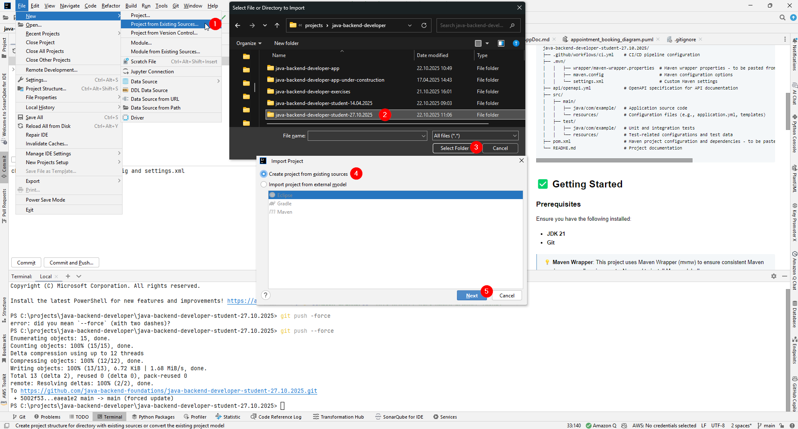
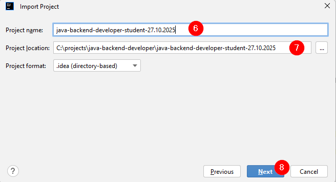
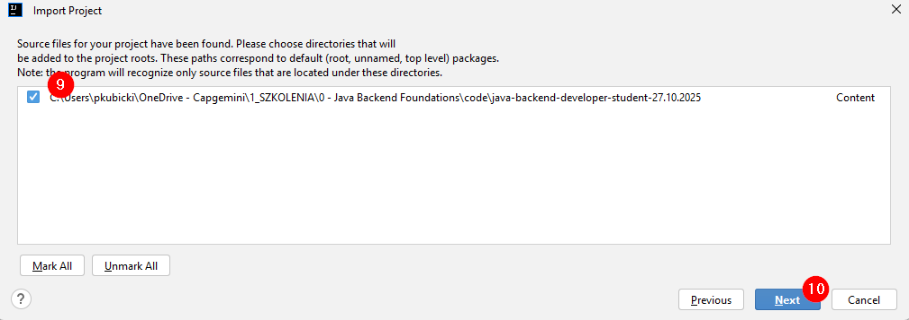
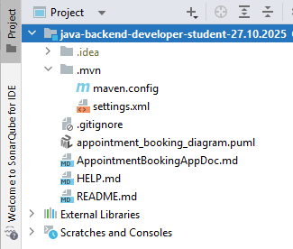

# Java Backend Developer – Student Repository

> 📌 **This repository is intended for training participants to implement their own solutions during the Java Backend
Developer course.**\
> Each participant works within their assigned group to develop the backend application following the provided
> exercises.

## 🚀 Project Overview

This repository serves as the working space for participants to develop the backend application from scratch.\
It follows the course structure and contains the necessary setup for hands-on exercises.

### The link to the instructions: [java-backend-developer-exercises](https://github.com/java-backend-foundations/java-backend-developer-exercises/)

### The link to the reference implementation of the application: [java-backend-developer-app](https://github.com/java-backend-foundations/java-backend-developer-app/)

### Here you will find the specification of the application we will develop during the course: [AppointmentBookingAppDoc.md](AppointmentBookingAppDoc.md).

### Check **[HELP.md](HELP.md)** for Reference Documentation and Guides.

## 📂 Repository Structure

```
java-backend-developer-student-20.04.2026/
├── .github/workflows/ci.yml    # CI/CD pipeline configuration
├── .mvn/                       
│   │   ├── wrapper/maven-wrapper.properties  # Maven wrapper properties - to be pasted from your code generated by Spring Initializr
│   │   ├── maven.config                      # Maven configuration options
│   │   └── settings.xml                      # Custom Maven settings
├── api/openapi.yml             # OpenAPI specification for API documentation
├── src/
│   ├── main/
│   │   ├── java/com/example/   # Application source code
│   │   └── resources/          # Configuration files (e.g., application.yml, templates)
│   ├── test/
│   │   ├── java/com/example/   # Unit and integration tests
│   │   └── resources/          # Test-related configurations and test data
├── pom.xml                     # Maven project configuration and dependencies - to be pasted from your code generated by Spring Initializr
└── README.md                   # Project documentation
```

## ✅ Getting Started

### Prerequisites

Ensure you have the following installed:

- **JDK 21**
- **Git**

> 💡 **Maven Wrapper**: This project uses Maven Wrapper (mvnw) to ensure consistent Maven version across all
> environments. No need to install Maven globally.

### Clone the Repository

```sh
git clone https://github.com/java-backend-foundations/java-backend-developer-student-20.04.2026.git

cd java-backend-developer-student-20.04.2026
```

### Open Project in IntelliJ IDEA

1. **Open IntelliJ IDEA** and select **File → New → Project from Existing Sources**.
2. **Navigate to the cloned repository folder** and select it, then click **OK**.
3. **Choose "Create project from existing sources"**, then click **Next**:

   

4. **Assure following setup**, then click **Next**

   

5. **Select content in the window below**, then click **Next**

   

6. After you click **Create** you should see this:

   

> 🎯 **IMPORTANT NEXT STEP**: After completing these steps, you should see the project structure with skeleton/scaffold
> files.
>
> 📋 **Now you need to paste your own files generated from Spring Initializr into this project:**
> - Add your generated `pom.xml`, right click on it --> choose **"Add as Maven Project"**. Now IntelliJ will recognize
    this project as Maven Project.
> - Don't forget about `.mvn/wrapper/maven-wrapper.properties` from your generated version
> - Add all your files accordingly

## 🔄 Git Workflow

- Each participant works within their **assigned group**.

- Each group has **two branches**:

    - `working/group-X` → Used for active development.
    - `solution/group-X` → Used for submitting solutions.

- Create a new branch before making changes:

  ```sh
  git checkout -b working/group-1
  ```

- Commit changes following [Conventional Commits](https://www.conventionalcommits.org/):

  ```sh
  git commit -m "feat: implement user authentication"
  ```

- Push your changes to the remote repository:

  ```sh
  git push origin working/group-1
  ```

- Open a **Pull Request** to merge changes from `working/group-X` to `solution/group-X`.

- Trainers will **review** and provide feedback on the Pull Request.

## ⚠️ Repository Guidelines

- **Do not push directly to **`solution/group-X`** branches.**
- Follow the course exercises and implement solutions **incrementally**.
- Seek feedback from **trainers and peers** before merging changes.

## 🚀 CI/CD Pipeline

- Every Pull Request to `solution/group-X` triggers a CI/CD pipeline.
- The pipeline will:
    - **Run unit and integration tests** to validate the changes.
    - **Ensure code quality checks pass** before merging.
- If a test fails, the team must **fix the issues** before merging the changes.

---

## 🔧 Build and Run

**Using Maven Wrapper (Recommended):**

```sh
# Windows
.\mvnw.cmd clean install
.\mvnw.cmd spring-boot:run

# Unix/Linux/macOS
./mvnw clean install
./mvnw spring-boot:run
```

**Configure Maven Wrapper in IntelliJ (Recommended)**

To use Maven Wrapper in IntelliJ instead of global Maven:

1. Go to **File → Settings** (or **IntelliJ IDEA → Preferences** on macOS)
2. Navigate to **Build, Execution, Deployment → Build Tools → Maven**
3. Set **Maven home path** to: `Use Maven wrapper`
4. Click **Apply** and **OK**

This ensures IntelliJ uses the project's Maven Wrapper for all Maven operations.

**Alternative - Using Global Maven:**

```sh
mvn clean install
mvn spring-boot:run
```

> ⚠️ **Trade-off**: Global Maven may use different version/settings than intended, potentially causing build
> inconsistencies or conflicts with commercial project configurations.

## 🧪 Testing

**Using Maven Wrapper (Recommended):**

```sh
# Windows
.\mvnw.cmd clean test
.\mvnw.cmd clean verify

# Unix/Linux/macOS
./mvnw clean test
./mvnw clean verify
```

**Alternative - Using Global Maven:**

```sh
mvn clean test
mvn clean verify
```

---

## 📜 License

This repository is **for educational purposes only** and is **not intended for commercial use**.\
Any distribution or external use of the code requires **explicit permission**.
